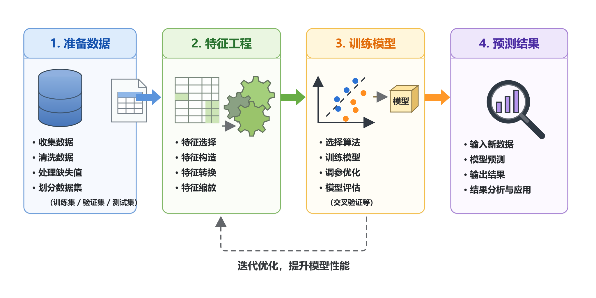

# 监督学习概述

在监督学习中，假设训练数据与测试数据是依同一个联合概率分布 $P(x,y)$ 独立同分布产生的。

根据输入和输出变量的不同类型，对预测任务给予不同的名称：

- 回归问题：输入变量与输出变量均为连续变量的预测问题;
- 分类问题：输入变量可以是连续变量也可以是离散变量，输出变量为离散变量的预测问题;
- 序列标注问题：输入变量与输出变量均为离散变量的序列的预测问题;

### 监督学习的三要素：

$$
方法=模型+策略+算法
$$

* 监督学习的模型可以分为：概率模型与非概率模型、生成模型与判别模型、参数化模型与非参数化模型；

* 监督学习的两个基本策略：经验风险最小化和结构风险最小化;

  损失函数（代价函数）是 $f(x)$ 和 $y$ 的非负实值函数，记作 $L(y,f(x))$ ,用于度量模型一次预测的效果。风险函数度量平均意义下模型预测的效果。

  经验风险（经验损失）函数 $R_{emp}(f)$ 用于估计期望风险（期望损失）$R_{exp}(f)$ 。
  $$
  R_{emp}(f)=\frac{1}{N}\sum_{i=1}^{N}L(y_i,f(x_i))
  $$
  结构风险最小化（SRM）是为了防止过拟合而提出的策略。结构风险的定义是
  $$
  R_{srm}=\frac{1}{N}\sum_{i=1}^{N}L(y_i,f(x_i))+\lambda\Omega(f)
  $$

* 监督学习的算法依据训练模式，可分为在线学习与批量学习；

### 模型选择

 模型选择的依据：

* 选择测试误差最小的模型；
* 选择偏差和方差之和最小的模型；

模型选择的方法：正则化与交叉验证。

* 正则化符合奥卡姆剃刀原理，用于选择经验风险与模型复杂度同时较小的模型（结构风险最小化）。
* 交叉验证中应用最多的是S折交叉验证。

### 机器学习步骤

